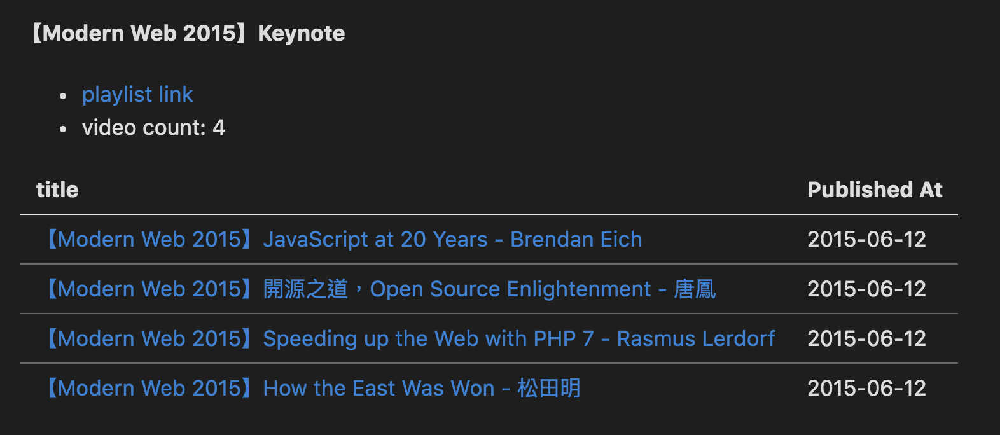

# Youtube playlist markdown


[](LICENSE)


<!-- [](https://david-dm.org/alincode/youtube-playlist-markdown) -->

### Features

* it could help you easy to get all playlist informations.
* you could use `TODO` variable to change the table style.
### Requirements

* node 8.x.x
### Install

```
npm i youtube-playlist-markdown --save
```

## Example

* [How to Get YouTube API Key - Easy way - YouTube](https://www.youtube.com/watch?v=_U_VS12uu-o)
### try it

```js
const youtubePlaylistMarkdown = require('youtube-playlist-markdown');

const config = {
    "GOOOGLE_API_KEY": "YOUR_GOOOGLE_API_KEY",
    "MARKDOWN_FILE_NAME": "generator.md",
    "CHANNEL_ID": "UCJi9ZAuo99MqMuJUXiJjpsA",
    "TODO": false
}

youtubePlaylistMarkdown(config);
```

or

Then make your own config, you could copy `config/example.json` to `config/development.json`.

```bash
git clone https://github.com/alincode/youtube-playlist-markdown
cd youtube-playlist-markdown
cp config/default.json config/development.json
vi config/development.json
npm start
```

### Output Example



## License

[MIT](LICENSE)