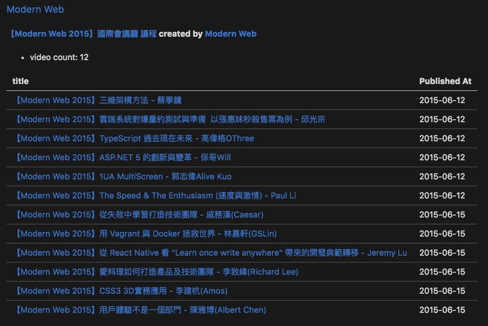

# Youtube playlist markdown


[](LICENSE)

<!-- [](https://david-dm.org/alincode/youtube-playlist-markdown) -->

It could help you scan all playlist information and generate friendly markdown table, look like below. if you want to use [**cli mode**](https://www.npmjs.com/package/youtube-playlist-markdown-cli), you could go [here](https://www.npmjs.com/package/youtube-playlist-markdown-cli).



### Features

* You could choose get all playlist or only one.
### Requirements

* node 8.x.x
### Install

```
npm i youtube-playlist-markdown --save
```
### Usage

First, you need to get your API key, if you don't know how to do, maybe this video could help you.

[How to Get YouTube API Key - Easy way - YouTube](https://www.youtube.com/watch?v=_U_VS12uu-o)

then

```js
const YoutubePlaylistMarkdown = require('youtube-playlist-markdown');

const config = {
  "GOOOGLE_API_KEY": "========== YOUR_GOOGLE_API_KEY =========="
};

let ypm = new YoutubePlaylistMarkdown(config);

const playlistId = 'PLrG78JjvL7hWqX2FW54Ck8UP45fbWQXcu';
ypm.generatorPlaylist(playlistId);

const channelId = 'UCJi9ZAuo99MqMuJUXiJjpsA';
ypm.generatorAll(channelId);
```

## Relevant Projects

* [youtube-playlist-summary](https://github.com/alincode/youtube-playlist-summary)
* [youtube-playlist-markdonw-cli](https://github.com/alincode/youtube-playlist-markdown-cli)

## License

MIT © [alincode](https://github.com/alincode/youtube-playlist-markdown)